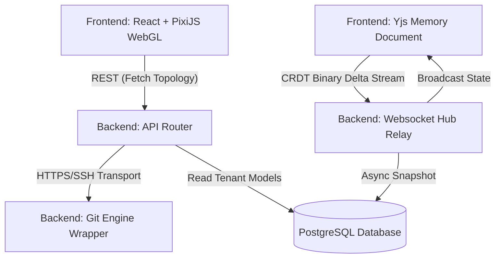

# Architecture Overview

This document describes the high-level system interactions of the Collaborative Git Visualization Platform.

## Core Topology

The system uses an asynchronous stateless UI binding via WebGL (`frontend/`), communicating with an interactive binary websocket relay and pure-git integration core (`backend/`). Storage maintains strict relational rules in PostgreSQL.

## Flow Diagram

## Security Posture
*   Credentials encrypted symmetrically utilizing AES-256-GCM.
*   Containers executed entirely rootless.
