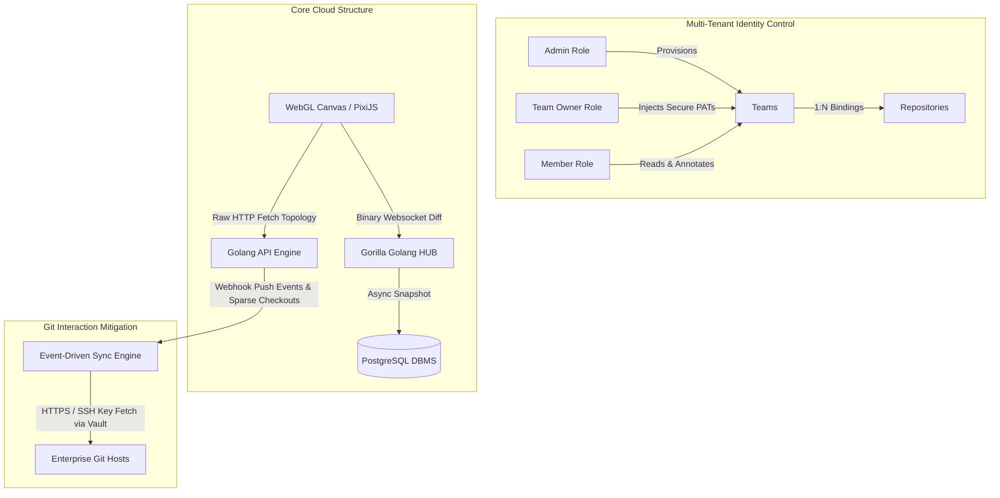

# System Architecture & Infrastructure

This document extensively maps the deployment mechanics, multi-tenancy rules, and real-time visualization frameworks powering the Collaborative Git Visualization Platform.

## 1. High-Level Architecture
The system operates exclusively as a Cloud-Native architecture, securely orchestrated natively over **Podman**. Operating rootless, daemonless containers enables the framework to execute securely on rigid self-hosted enterprise infrastructure topologies. 
*   **Network Constraint:** Strict HTTPs proxying encrypts payload traffic continuously.
*   **Encrypted Datastore & Secrets Management:** We utilize PostgreSQL mapped natively to store complex customized maps (annotations, cross-links). Tenant SSH/PAT credentials and cryptographic keys are managed via a dedicated Secrets Management Layer (e.g., HashiCorp Vault) ensuring the backend never persistently holds master cryptographic keys alongside tenant data.

## 2. Real-Time Collaboration Pipeline
A primary architectural vector guarantees that multiple team members visualize the same topological space without locking threads.
*   **WebSockets (`apps/backend/ws`):** Serves as a bidirectional binary pipeline isolating map transactions natively from standard REST operations.
*   **Conflict-Free Replicated Data Types (CRDT):** Leverages `Yjs` architecture natively in the memory to merge cursor activity tracking and payload annotations dynamically ensuring deterministic collision-free state across disparate browsers precisely modeling a Miro-like workspace canvas.

## 3. Visualization Canvas Matrix
The front-end rendering cycle utilizes **WebGL (PixiJS)** specifically, sidestepping the DOM rendering engine explicitly to tackle the **Frontend Rendering Performance Challenge**. 

### Culling mathematical bounds:
1.  **Server-Side Graph Aggregation:** To mitigate network payloads for massive Git DAGs, the backend dynamically clusters older, non-critical linear commits into aggregated blocks based on semantic zoom levels, transmitting only structural splits and merges until explicitly requested.
2.  **Branch Rendering Constraints:** Branches map distinct horizontal axes. They track chronologically sorting strictly off the origin (Oldest equals origin Y-axis top bounds).
3.  **Topological Connecting Diagonals:** Splitting and Merging are inherently mapped by calculating Bezier splines interconnecting origin structural origin IDs explicitly targeting exact horizontal layout lane crossings.
4.  **Virtualization Mitigation:** PixiJS math restricts rendering calls exclusively to coordinate targets residing visually inside the active window boundaries, purging tens of thousands of unused commits safely from the GPU pipeline buffer rendering load cycle.

## Diagram Visualization mapping Context

