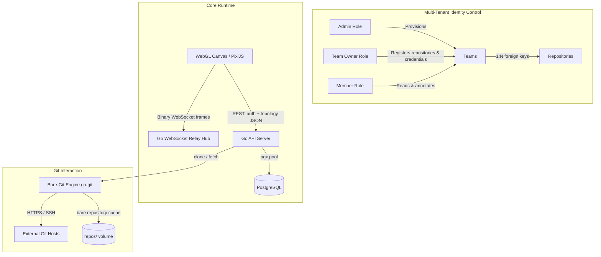
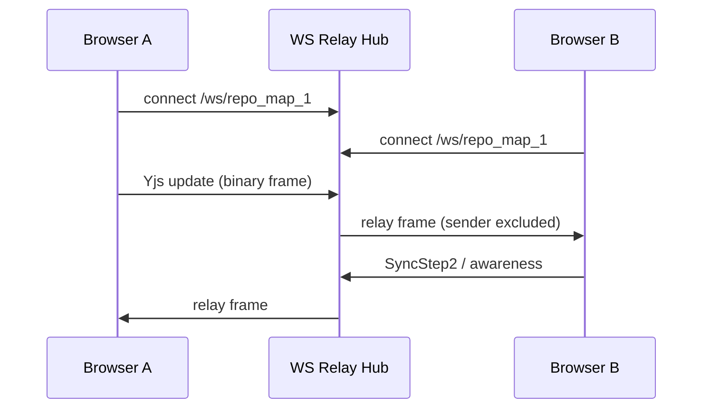
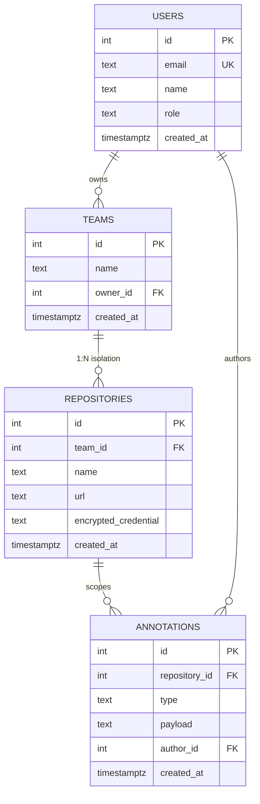

# System Architecture

This document describes the deployment topology, multi-tenancy model, and
real-time visualization pipeline of the Collaborative Git Visualization
Platform.

## 1. High-Level Architecture

The system is a cloud-native application designed for self-hosted, zero-trust
environments and orchestrated with **Podman** (rootless, daemonless
containers). Three runtime components cooperate:

| Component | Technology | Responsibility |
| :--- | :--- | :--- |
| Frontend | React + PixiJS (WebGL) | Infinite collaborative canvas, HUD, client-side filtering |
| Backend | Go | REST API, JWT/OAuth2 authentication, bare-git engine, WebSocket relay |
| Database | PostgreSQL | Users, teams, repositories, annotation metadata |

Operational constraints:

* **Transport security** — all external traffic is expected to terminate at
  an HTTPS/WSS reverse proxy in front of the backend and frontend services.
* **Credential handling** — repository credentials are encrypted with
  AES-256-GCM (`src/crypto`) before persistence. A dedicated secrets
  management layer (e.g. HashiCorp Vault) is the production target for the
  master keys so the backend never stores keys alongside tenant data
  (roadmap item).

## 2. Real-Time Collaboration Pipeline

Multiple team members view and annotate the same topological space without
locks or merge conflicts:

* **WebSocket relay (`apps/backend/src/ws`)** — a room-scoped binary relay.
  Clients join a room (one per repository map, `repo_map_<id>`); every binary
  frame a client sends is forwarded verbatim to all other clients in the same
  room. Hub state is owned by a single event-loop goroutine, so membership
  and broadcast operations need no locking. Rooms are resolved from the
  `/ws/<room>` path segment (the y-websocket convention), with a
  `?room_id=` query parameter fallback.
* **CRDT layer (Yjs)** — the frontend maintains a shared `Y.Doc` per room.
  Drawn annotation vectors live in a `Y.Array` (`annotations`); live cursor
  positions travel over the Yjs *awareness* protocol. Because Yjs operations
  are commutative, concurrent edits from different browsers converge
  deterministically.

> **Design limitation (documented in `src/ws`):** the relay does not
> interpret the Yjs sync protocol and keeps no server-side document copy.
> Peers answer each other's sync steps, so a client that is alone in a room
> receives no initial state. Server-side document snapshots to PostgreSQL
> are the planned remedy (see roadmap).

## 3. Visualization Canvas

Rendering bypasses the DOM entirely: the commit graph is drawn through
**PixiJS** onto a WebGL context, with React managing only the HUD and
floating panels.

### Layout model

1. **Chronological X axis** — the backend layout pass sorts all commits by
   author date and assigns `x_offset = (epoch − origin_epoch) × 0.05` pixels,
   so horizontal distance encodes time.
2. **Branch lanes (Y axis)** — each commit either takes over the lane of its
   primary parent or claims the lowest free lane, producing stable horizontal
   branch tracks ordered oldest-first.
3. **Split/merge connectors** — parent→child edges that cross lanes are drawn
   as cubic Bezier curves with the control points at the horizontal midpoint;
   same-lane edges are straight segments.
4. **Multi-repo unification** — node ids and parent references are prefixed
   `<RepoID>_<SHA>` so several repositories can share one canvas without hash
   collisions.
5. **Label priority** — a commit's label shows its tag when present,
   otherwise its short hash.

### Viewport

The world container carries a `{x, y, scale}` transform. Wheel input zooms
multiplicatively, anchored at the pointer (the world point under the cursor
stays fixed); dragging pans. All pointer interactions — drawing vectors and
cursor broadcasts — are converted to world coordinates first, so
collaborators see them anchored to the graph rather than to their screens.

### Planned scale mitigations (roadmap)

* **Server-side graph aggregation** — clustering old linear runs of commits
  into aggregate blocks by semantic zoom level to bound payload size.
* **Viewport culling** — restricting draw calls to nodes inside the visible
  window to keep GPU load independent of total graph size.

## 4. Data Model

The schema is applied idempotently on every backend boot
(`src/db.Migrate`). The backend degrades gracefully when PostgreSQL is
unreachable: it logs a warning and serves topology from its local bare-repo
cache, which keeps local development friction-free.
