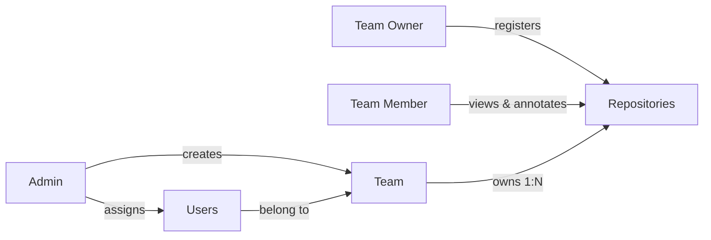

# Access Administration Manual

Audience: platform administrators responsible for granting access — creating
teams, assigning users, and connecting repositories. Assumes the platform is
already hosted (see the [Cloud Administrator Manual](./cloud-admin-guide.md)).

## 1. The Access Model

Access control is role-based and team-scoped. Every session token (JWT)
carries three claims — `user_id`, `team_id`, `role` — and every protected
request is evaluated against them.

| Role | Scope | Permissions |
| :--- | :--- | :--- |
| **Admin** | Platform | Provisions teams; assigns users to teams |
| **Team Owner** | One team | Registers repositories and their credentials for the team |
| **Team Member** | One team | Views team repositories; collaborates (cursors, annotations) |

Isolation is enforced in two layers:

1. **Database** — `repositories.team_id → teams.id` foreign keys make
   repository access team-scoped by construction (1:N).
2. **API** — middleware rejects requests without a valid JWT (`401`) and
   requests whose team is not authorized for the target repositories
   (`403`).



## 2. Current Release Scope — Read This First

The RBAC enforcement machinery (JWT claims, middleware, schema foreign keys)
is fully implemented, but **self-service identity management is not yet**:

* There is **no admin UI or user-management API**. Users, teams, and
  repositories are provisioned directly in PostgreSQL (Section 3).
* The GitHub OAuth sign-in flow works end-to-end (CSRF-protected), but
  GitHub profiles are **not yet mapped onto database users** — every
  successful login currently receives the *single-tenant default identity*:
  user `1`, team `100`, role `Team Owner`.
* Consequently the platform today operates as **one shared workspace**
  (team `100`). The provisioning steps below prepare your data for the
  multi-tenant identity mapping on the roadmap, and team `100` is the team
  the topology API authorizes.

Treat access to the application URL itself as the effective access boundary
for this release (e.g. put it behind your SSO-protected proxy or VPN).

## 3. Provisioning Reference

Connect to the database (compose example):

```bash
podman exec -it <postgres-container> psql -U git_viz -d git_interactive_history
```

### 3.1 Create users

```sql
INSERT INTO users (email, name, role)
VALUES
  ('admin@acme.io',  'Platform Admin', 'Admin'),
  ('owner@acme.io',  'Alice Owner',    'Team Owner'),
  ('dev1@acme.io',   'Bob Developer',  'Team Member');
```

### 3.2 Create the team

The active workspace team id is `100` (the single-tenant default):

```sql
INSERT INTO teams (id, name, owner_id)
VALUES (100, 'Platform Engineering',
        (SELECT id FROM users WHERE email = 'owner@acme.io'));
```

### 3.3 Register repositories for the team

```sql
INSERT INTO repositories (team_id, name, url)
VALUES
  (100, 'platform',  'https://github.com/acme/platform.git'),
  (100, 'api-gateway','https://github.com/acme/api-gateway.git');
```

The `id` assigned to each row is the `repo_id` users load on the canvas
(`/api/v1/topology?repo_ids=1,2`). Anonymous HTTPS fetch covers public
repositories; private-repository fetch using the encrypted credential column
is a roadmap item — for private code today, ask the hosting operator to seed
a bare clone on the repos volume instead (Cloud Administrator Manual §6).

### 3.4 Repository credentials (prepared, roadmap-activated)

The `repositories.encrypted_credential` column stores AES-256-GCM-encrypted
PATs or SSH keys (`src/crypto.Encrypt`). Populate it only through the
backend's crypto helpers — never store plaintext credentials — and plan for
the master key to live in your secrets manager.

### 3.5 Revoking access

| Action | Effect |
| :--- | :--- |
| `DELETE FROM repositories WHERE id = …` | Repository disappears from topology resolution (annotation rows must be removed first — FK) |
| Remove a user row | Prevents future identity mapping; active JWTs remain valid until expiry (24 h) |
| Rotate `JWT_SECRET` | Immediately invalidates **all** outstanding sessions platform-wide |

## 4. Sessions & Tokens

| Property | Value |
| :--- | :--- |
| Format | JWT, HS256, signed with `JWT_SECRET` |
| Lifetime | 24 hours from issuance |
| Claims | `user_id`, `team_id`, `role`, `exp`, `iat` |
| Transport | `Authorization: Bearer <token>` header |

There is no server-side session store: revocation before expiry is only
possible by rotating `JWT_SECRET` (global) — plan role changes accordingly.

## 5. Audit Checklist

* [ ] `JWT_SECRET` is unique, random, and stored in your secrets manager.
* [ ] The development login endpoint (`/api/v1/auth/login`) is blocked at
      the proxy in hardened deployments, leaving only the OAuth flow.
* [ ] Database credentials differ from the defaults in the compose file.
* [ ] Every repository row belongs to the intended team (`team_id`).
* [ ] The application URL is reachable only by the intended audience
      (VPN/SSO proxy) while single-workspace mode applies.
