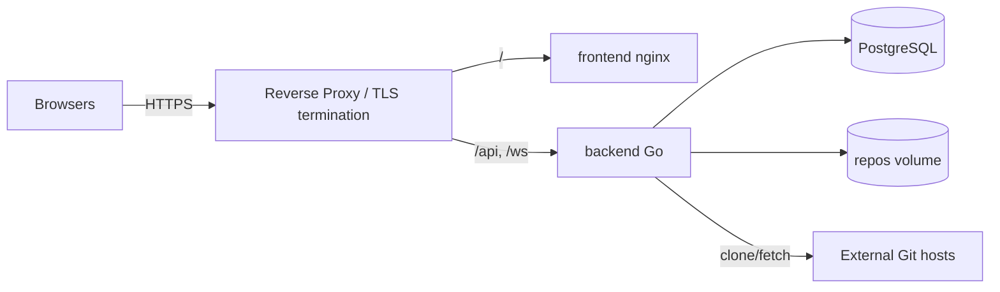

# Cloud Administrator Manual

Audience: operators hosting the Collaborative Git Visualization Platform on
their own infrastructure. Covers deployment with Podman/Docker Compose and
Kubernetes, configuration, secrets, persistence, monitoring, and
troubleshooting.

## 1. System Overview

| Service | Image source | Port | Stateful data |
| :--- | :--- | :--- | :--- |
| `frontend` | `apps/frontend/Dockerfile` (build context: repo root) | 80 (mapped to 3000 locally) | none |
| `backend` | `apps/backend/Dockerfile` | 8080 | bare-repo cache volume |
| `postgres` | `postgres:15-alpine` | 5432 | database volume |



> **Transport security:** the services speak plain HTTP/WS. Always terminate
> TLS at a reverse proxy (Caddy, nginx, Traefik, or an ingress controller)
> and forward `/api` and `/ws` to the backend. WebSocket upgrades must be
> enabled on the `/ws` route.

## 2. Prerequisites

* A container runtime — Podman (preferred, rootless) or Docker.
  On Ubuntu/Debian: `sudo apt install podman podman-compose`
* DNS name and TLS certificate for the public hostname.
* Outbound network access from the backend to your Git hosts (HTTPS/SSH).

## 3. Configuration Reference

All backend settings are environment variables
(template: `apps/backend/.env.example`).

| Variable | Required | Default | Description |
| :--- | :--- | :--- | :--- |
| `DATABASE_URL` | recommended | local dev DSN | PostgreSQL connection string. If unreachable, the backend logs a warning and runs without persistence |
| `PORT` | no | `8080` | Backend HTTP listen port |
| `JWT_SECRET` | **yes (production)** | dev fallback | HS256 signing key for session JWTs. **Must** be overridden in production; rotate periodically |
| `GITHUB_CLIENT_ID` | for OAuth | empty | GitHub OAuth app client id |
| `GITHUB_CLIENT_SECRET` | for OAuth | empty | GitHub OAuth app client secret |
| `OAUTH_REDIRECT_URL` | for OAuth | local callback | Must exactly match the OAuth app's authorization callback URL |

Frontend build-time variable:

| Variable | Default | Description |
| :--- | :--- | :--- |
| `VITE_API_URL` | `http://localhost:8080` | Backend base URL baked into the bundle at build time. Set it when the API is not served from the same origin |

### Creating the GitHub OAuth application

1. GitHub → *Settings → Developer settings → OAuth Apps → New OAuth App*.
2. Homepage URL: `https://<your-host>`.
3. Authorization callback URL:
   `https://<your-host>/api/v1/auth/github/callback`.
4. Copy the client id/secret into the backend environment and set
   `OAUTH_REDIRECT_URL` to the same callback URL.

## 4. Deployment — Podman/Docker Compose

```bash
git clone <this-repository>
cd GIT_Interactive_History_APP/infra

# Provide production secrets (compose reads a .env file in this directory)
cat > .env <<'EOF'
JWT_SECRET=<long-random-string>
GITHUB_CLIENT_ID=<id>
GITHUB_CLIENT_SECRET=<secret>
OAUTH_REDIRECT_URL=https://<your-host>/api/v1/auth/github/callback
EOF

podman-compose up -d        # or: docker compose up -d
```

What the compose file already handles for you:

* PostgreSQL healthcheck — the backend starts only after the database is
  ready.
* Named volumes — `pgdata` (database) and `repodata` (bare-repo cache).
* The frontend image is built from the repository root context (required for
  the npm workspace packages).

> **Change the database password** for any non-local deployment: update
> `POSTGRES_PASSWORD` and the `DATABASE_URL` in `infra/docker-compose.yml`
> together.

### Verification

```bash
curl -fsS http://localhost:8080/health        # → OK
curl -fsS http://localhost:8080/api/v1/auth/login | head -c 120
# open http://localhost:3000
```

## 5. Deployment — Kubernetes

Manifests live in `infra/kubernetes/` (Kustomize: `base/` plus a
`overlays/production/` overlay that raises replica counts and sets the
`production-git-viz` namespace).

```bash
# 1. Build and push images to your registry
podman build -t <registry>/git-interactive-backend:latest apps/backend
podman build -t <registry>/git-interactive-frontend:latest -f apps/frontend/Dockerfile .
podman push <registry>/git-interactive-backend:latest
podman push <registry>/git-interactive-frontend:latest

# 2. Point the Deployments at your registry (kustomize images field or edit)

# 3. Provision real secrets — do NOT ship the placeholder
kubectl create secret generic git-viz-secrets \
  --from-literal=jwt-secret="$(openssl rand -base64 48)" \
  --from-literal=github-client-id="<id>" \
  --from-literal=github-client-secret="<secret>" \
  -n production-git-viz --dry-run=client -o yaml | kubectl apply -f -

# 4. Deploy
kubectl apply -k infra/kubernetes/overlays/production
```

Notes:

* `infra/kubernetes/base/secrets.yaml` contains **dev placeholder values
  only** — override it in any real cluster (step 3) or, preferably, source
  secrets from Vault/External Secrets (the documented production target).
* The backend Deployment has no PersistentVolume for the repo cache; with
  multiple replicas each pod re-clones on demand. Acceptable for read-only
  visualization; attach a PVC if clone traffic to your Git hosts is a
  concern.
* Expose the frontend Service via your ingress; route `/api` and `/ws`
  (with WebSocket upgrade) to the backend Service.

## 6. Provisioning Repositories

The topology endpoint resolves repository ids in this order:

1. A row in the `repositories` table → cloned/fetched from its `url` by the
   backend (anonymous HTTPS today; credentialed fetch via the encrypted
   credential is a roadmap item).
2. A pre-seeded bare repository on the backend's repos volume:
   `repos/mock_<id>.git`, then `repos/repo_<id>.git`.

Database-backed example (see the
[Access Administration Manual](./access-admin-guide.md) for the full
provisioning flow):

```sql
INSERT INTO repositories (team_id, name, url)
VALUES (100, 'platform', 'https://github.com/acme/platform.git');
```

Volume-seeded example (compose):

```bash
podman run --rm -v infra_repodata:/repos docker.io/alpine/git \
  clone --bare https://github.com/acme/platform.git /repos/mock_1.git
```

## 7. Backup & Restore

| Data | Location | Method |
| :--- | :--- | :--- |
| Database | `pgdata` volume / StatefulSet PVC | `pg_dump` on a schedule; restore with `psql` |
| Repo cache | `repodata` volume | Disposable — re-cloned on demand; no backup required |
| Secrets | your secret store | Per your organization's policy |

```bash
podman exec -t <postgres-container> pg_dump -U git_viz git_interactive_history > backup.sql
```

## 8. Monitoring & Operations

* **Liveness** — `GET /health` on the backend returns `200 OK`; wire it into
  container healthchecks and LB probes.
* **Logs** — the backend logs to stdout. Significant lines:
  `WARNING: database unreachable…` (running without persistence) and
  `Starting server on port…`.
* **Schema migrations** — applied idempotently on every backend boot; no
  manual migration step exists.
* **Scaling** — the backend is stateless apart from the repo cache;
  WebSocket rooms are **per-instance**, so collaborative sessions require
  session affinity (sticky sessions) on `/ws` when running multiple
  replicas.

## 9. Troubleshooting

| Symptom | Likely cause | Remedy |
| :--- | :--- | :--- |
| Frontend HUD shows `Error: …` immediately | Backend unreachable or wrong `VITE_API_URL` | Check backend health, rebuild frontend with correct `VITE_API_URL` |
| `404` from `/api/v1/topology` | No repository resolves for the requested ids | Provision a `repositories` row or seed `repos/mock_<id>.git` |
| `401` from `/api/v1/topology` | Missing/expired JWT | Re-authenticate; check `JWT_SECRET` consistency across replicas |
| OAuth callback returns `401 invalid oauth state` | Cookie lost (cross-site redirect, >10 min delay) or callback URL mismatch | Verify `OAUTH_REDIRECT_URL` matches the OAuth app exactly; same-site proxying |
| Collaborators don't see each other | Replicas without sticky sessions on `/ws`, or different rooms | Enable session affinity; both clients must load the same repository map |
| Backend log: `database unreachable` | DSN wrong or PostgreSQL down | Fix `DATABASE_URL`; the app still serves volume-seeded repos meanwhile |
